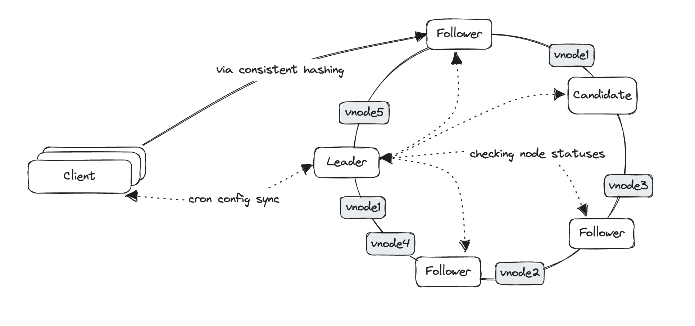

## speedy

Distributed cache implemented in Go.

Features:

- Client-side consistent hashing
- Distributed leader election via Raft (maybe Paxos/Bully)
- gRPC for communication between nodes

Docs:

- [Sharding algorithms](./docs/sharding.md)
