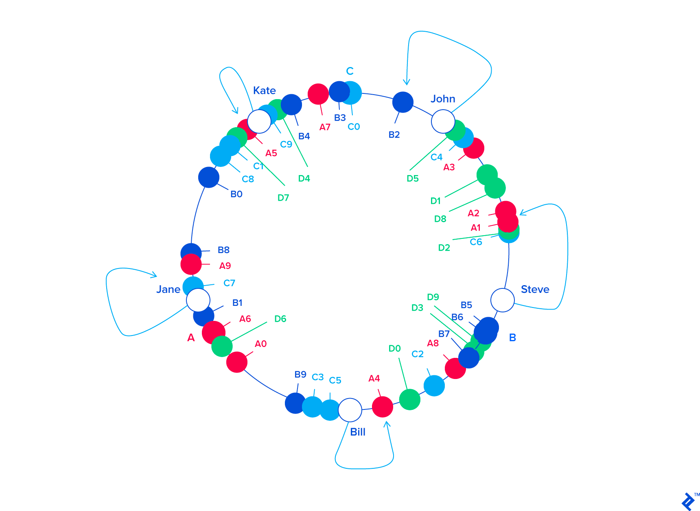
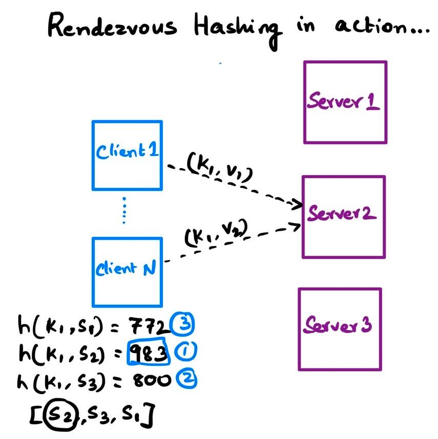

## Sharding

Sharding is a method of distributing data across multiple machines.

When you shard, you say you are moving data, but you haven't yet answered the question of which
machine receives which subset of data.

There are few algorithms, for assigning set of keys to a set of machines.

### Naive hashing algorithm

The simplest algorithm is to take a hash of the key and mod it by the number of machines.

```text
machine = hash(key) % num_machines
```

This algorithm is simple, but it has a few problems:

- It doesn't take into account the number of keys on each machine.

> Some machines may be overloaded, while others are underutilized.

- When number of machines changes, all keys are remapped to different machines.

> Adding, removing, or replacing a machine will cause a complete remapping of all keys.

### Consistent hashing

Specialized hashing algorithm that minimizes the number of keys that need to be remapped when
number of machines changes.

> On average `K/N` keys need to be remapped, where `K` - the total number of keys, and `N` - the number of machines.

In the consistent hashing the both keys and machines are placed on a ring.

A key maps to the first machine clockwise from it.



Searching for the bucket responsible for a key is pretty simple:

- precompute the hash values for all buckets
- sort them
- hash the key
- run a binary search to find the lowest value that's higher than the hash of the key.

When the buckets are resized, some keys move over to the closest new bucket.

One of the biggest drawbacks of consistent hashing is that keys can be imbalanced across buckets. This is mainly because
of how resizing is handled.

> For example, if a bucket is removed, all keys mapped to that bucket move over to the next
> one (similar for the case where a bucket is added).

Ideally, these keys would be distributed equally across all the remaining buckets. To overcome this problem, most
implementations divide each physical machine into multiple virtual nodes.

> This solves the problem of imbalanced keys, but it also adds more overhead to the system.
> Each virtual node needs to be tracked and mapped to a physical machine.

### Rendezvous hashing

Rendezvous hashing is simple + efficient hashing algorithm.
> It is also known as highest random weight (HRW) hashing.



The algorithm is based on the idea of a rendezvous:

- each key has a "meeting" with each server and the key selects the server with the highest random weight.
- the server with the highest random weight is the one that the key will be mapped to.

When a new server is added/deleted, not all the keys need to be remapped, because some keys still have
the same highest random weight.

> In the case of a uniform hash function, if the buckets change, the `K/N` keys get spread out over all
> other buckets instead of just one or the number of virtual nodes that were assigned to a machine.

The biggest drawback of rendezvous hashing is that it requires `O(N)` time to find the bucket responsible for a key.

### Comparison

| Algorithm                  | Time complexity | Keys distribution | Keys remapping |
|----------------------------|-----------------|-------------------|----------------|
| Naive                      | `O(1)`          | Non-uniform       | `O(K)`         |
| Consistent                 | `O(log N)`      | Non-uniform       | `O(K/N)`       |
| Consistent + virtual nodes | `O(log N)`      | Uniform           | `O(K/N)`       |
| Rendezvous                 | `O(N)`          | Uniform           | `O(K/N)`       |

### Resources

- https://medium.com/i0exception/rendezvous-hashing-8c00e2fb58b0


